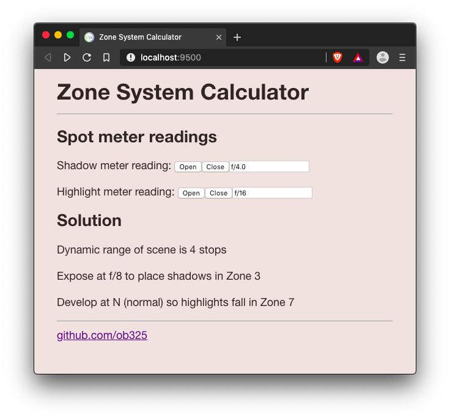

# exposure.core

A Zone System calculator for film photography

## Overview

This is a web app to help film photographers understand the Zone System in a contemporary sense. My advice is to skip Ansel Adams' books and take a class from a great teacher like Nick Johnson at New England School of Photography. 

Essentially, you want to expose the film so there's detail in the shadows (clearer parts of the negative). Then you want to control the density of the highlights (dark parts of the negative). If the highlights are really bright compared with the shadows, then you'd back off the development a bit. But if it's a low contrast scene, you'd extend development. That's what the N, N-1, N+1 development means. You have to experiment with your film and developer to figure out development times. 

To get an interactive development environment run:

    lein fig:build

This will auto compile and send all changes to the browser without the
need to reload. After the compilation process is complete, you will
get a Browser Connected REPL. An easy way to try it is:

    (js/alert "Am I connected?")

and you should see an alert in the browser window.

To clean all compiled files:

	lein clean

To create a production build run:

	lein clean
	lein fig:min

## License

Copyright © 2018 FIXME

Distributed under the Eclipse Public License either version 1.0 or (at your option) any later version.
